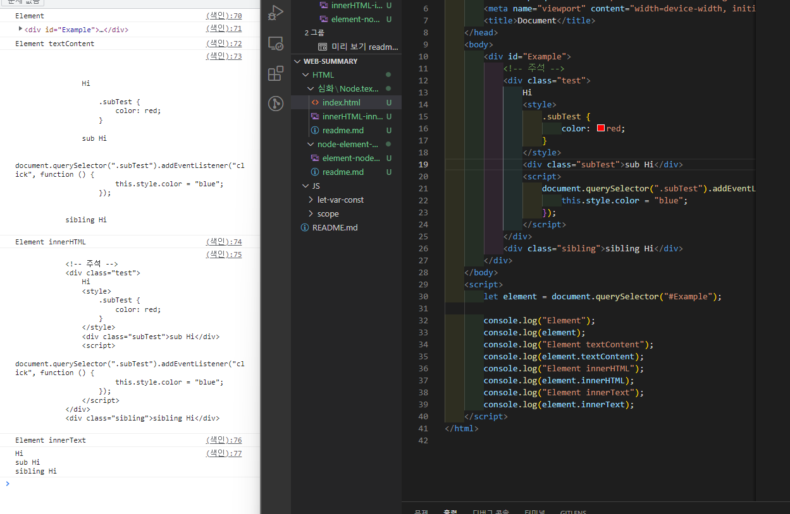

### [HTML] Node.textContent vs Element.innerHTML, innerText 비교

Node 인터페이스의 textContent 속성은 노드와 자손의 텍스트 콘텐츠를 표현한다.

#### 1) 값

문자열 or null

#### 2) 설명

textContent는 상황에 따라 다르게 리턴합니다.

document or DocType이면 null을 반환한다.

다른 Node유형일 시, 주석과 처리 명령을 제외한 모든 자식 노드의 textContent를 병합한 결과를 반환한다. 자식이 없는 경우 빈 문자열이다.

노드의 textContent를 설정하면 노드의 모든 자식을 주어진 문자열로 이루어진 하나의 텍스트 노드로 대치된다.

#### 3) innerText와 차이점

textContent는 \<script\>, \<style\> 요소를 포함해 모든 요소의 콘텐츠를 가져온다. 반면 innerText는 사람이 읽을 수 있는 요소만 처리한다.

textContent는 노드의 모든 요소를 반환한다. 밤녀에 innerText는 스타일링을 고려해, 숨겨진 요소의 텍스트는 반환하지 않는다.

innerText는 CSS 고려로 인해, innerText 값을 읽으면 최신 계산값으로 반영하려고 리플로우가 발생한다. (리플로우는 계산이 비싸므로 가능하면 피해야 한다.)

#### 4) innerHTML과 차이점

innerHTML은 말그대로 HTML을 반환한다. 간혹 innerHTML을 사용해 요소의 텍스트를 가져오거나 쓰는 경우도 있지만 HTML로 분석할 일이 없다면 textContent의 성능이 더 좋다.

또한 textContent는 XSS공격 위험이 없다.

